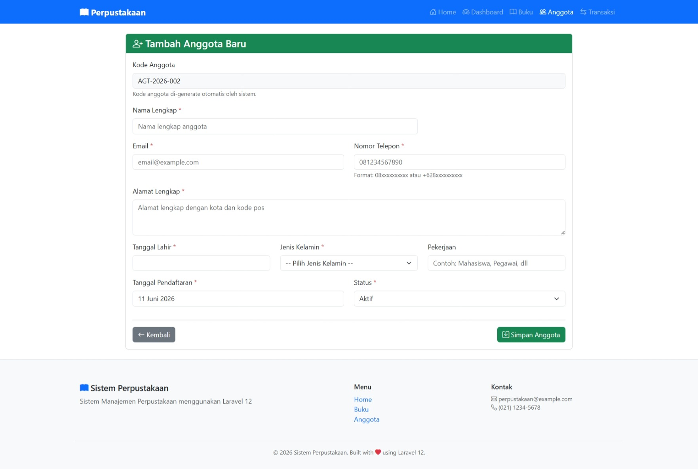
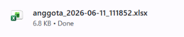
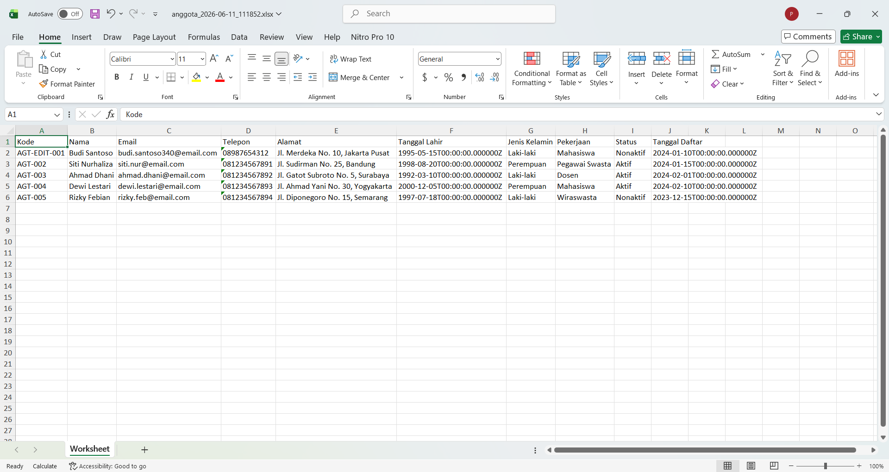
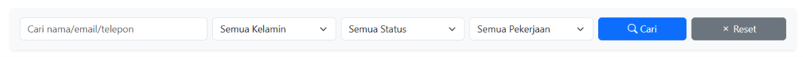

# Tugas Pemrograman Web 2 - Pertemuan 13

**Nama:** Ari Maulida Aprilia

**NIM:** 60324068 

---

## Tugas 1: Auto-Generate Kode Anggota (30%)

Implementasi fitur pembuatan kode anggota secara otomatis untuk memastikan standarisasi format dan mencegah kesalahan input manual saat pendaftaran anggota baru.

* **Format Kode Anggota:** Diwajibkan menggunakan format terstandar `AGT-[TAHUN]-[NOMOR_URUT]` (contoh: `AGT-2026-001`).
* **Logika Otomatisasi:** Menggunakan *helper function* `generateKodeAnggota()` di `AnggotaController` yang memeriksa nomor urut terakhir pada tahun aktif dan mem-formatnya menggunakan fungsi `str_pad`.
* **Proteksi Form Input:** Kolom kode anggota dikunci menggunakan atribut `readonly` pada file `create.blade.php` agar admin tidak bisa memanipulasi kode secara manual.

**Bukti Hasil Auto-Generate Kode:**

---

## Tugas 2: Export Anggota ke Excel (40%)

Implementasi fitur ekspor seluruh rekap data anggota dari database ke dalam format spreadsheet Excel (`.xlsx`) untuk kebutuhan pelaporan administrasi.

* **Integrasi Package:** Menggunakan package resmi `maatwebsite/excel` versi terbaru untuk menghasilkan file spreadsheet yang stabil dan kompeten.
* **Separation of Concerns:** Pembuatan *Export Class* `AnggotaExport` yang mengimplementasikan `FromCollection` untuk seleksi kolom database dan `WithHeadings` untuk penamaan judul kolom yang rapi.
* **Nama File Dinamis:** File yang diunduh otomatis menggunakan penamaan berbasis waktu *timestamp* (contoh: `anggota_YYYY-MM-DD_HHMMSS.xlsx`).

**Bukti Tombol Export di Index:**

**Hasil File Excel Anggota:**

---

## Tugas 3: Advanced Search & Filter (30%)

Penambahan fitur pencarian lanjutan dan filter spesifik untuk mempermudah pengelolaan serta penelusuran data anggota dalam skala besar.

* **Pencarian Multi-Field:** Mampu mencari anggota berdasarkan kata kunci (*keyword*) yang memeriksa kolom nama, email, dan nomor telepon sekaligus menggunakan klausa `orWhere`.
* **Filter Dropdown Fleksibel:** Menyediakan filter spesifik berdasarkan jenis kelamin, status keanggotaan (Aktif/Nonaktif), dan kategori pekerjaan (Mahasiswa/Pegawai/Wiraswasta).
* **Statistik Dinamis:** Angka ringkasan pada kotak statistik otomatis menyesuaikan secara *real-time* berdasarkan hasil data yang sedang disaring oleh pengguna.

**Bukti Hasil Advanced Search & Filter:**
