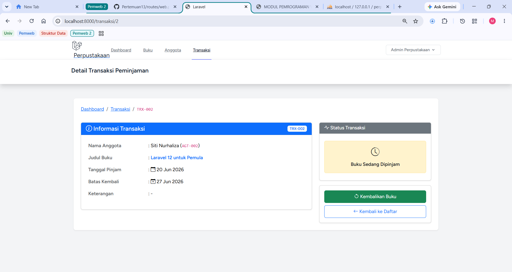
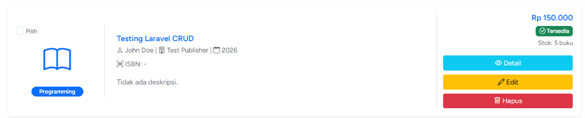
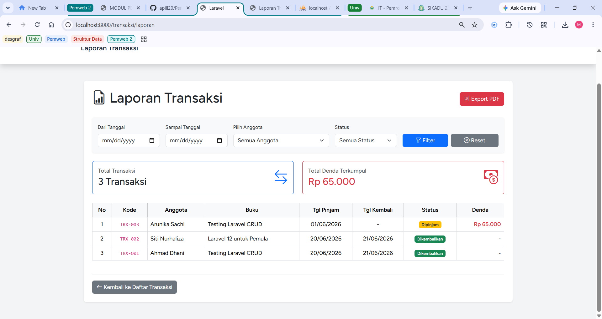
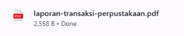
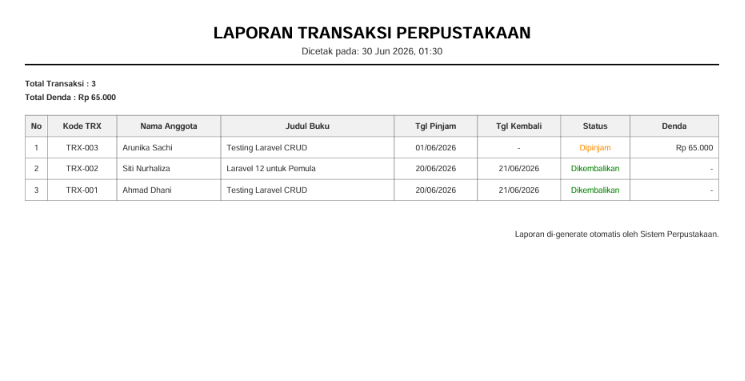
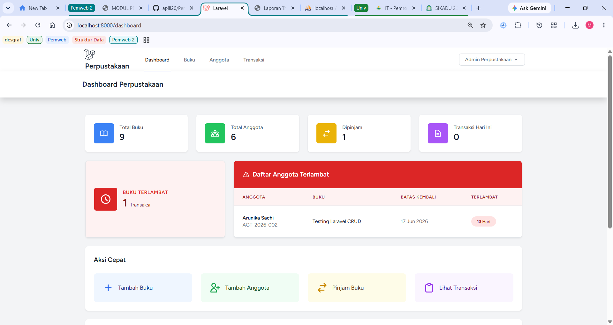
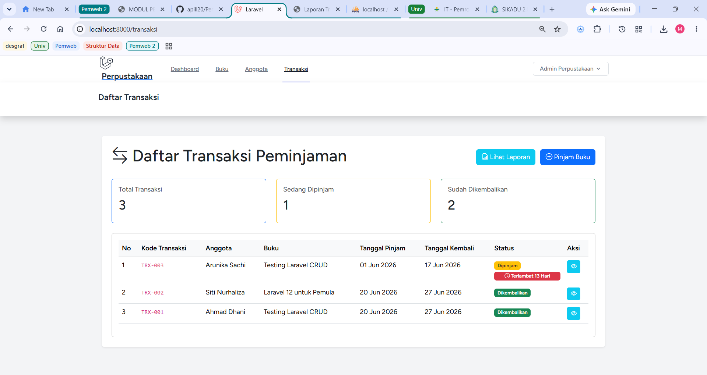
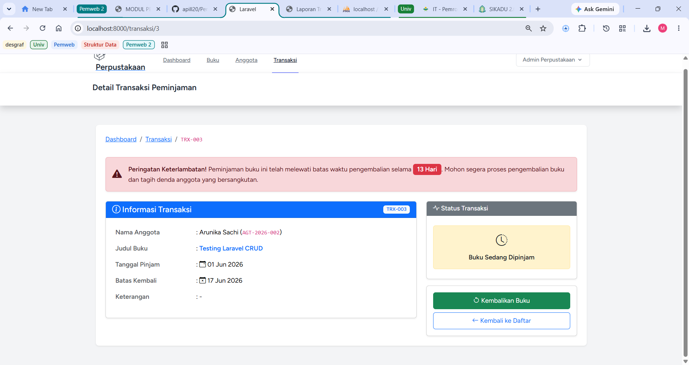

# Tugas Pemrograman Web 2 - Pertemuan 14

**Nama:** Ari Maulida Aprilia

**NIM:** 60324068 

---

### Tugas 1: Fitur Pengembalian Buku (40%)
- **View Detail Transaksi**: Menambahkan tombol "Kembalikan Buku".
- **Logika Pengembalian**: Implementasi fungsi *update* status menjadi "Dikembalikan".
- **Perhitungan Denda Otomatis**: Mendeteksi keterlambatan dan menghitung denda sebesar **Rp 5.000/hari**.
- **Update Stok Buku**: Otomatis menambah stok buku (+1) ketika buku selesai dikembalikan.

### Tugas 2: Laporan Transaksi (30%)
- **Halaman Filter Laporan**: Pembuatan antarmuka pencarian data transaksi (Route: `/transaksi/laporan`).
- **Multi-Filter**: Pencarian berdasarkan rentang tanggal (*dari-sampai*), Status, dan Anggota.
- **Ringkasan Statistik**: Menampilkan angka Total Transaksi dan Total Denda yang terkumpul.
- **Export PDF**: Implementasi `barryvdh/laravel-dompdf` untuk mencetak laporan transaksi sesuai filter ke dalam format PDF dengan ukuran kertas *Landscape*.

### Tugas 3: Notifikasi Terlambat (30%)
- **Dashboard Widget**: Menambahkan *Card* peringatan "Buku Terlambat" dan tabel daftar anggota yang telat mengembalikan buku.
- **Badge Peringatan di Index**: Memunculkan *badge* merah berisi informasi akumulasi hari keterlambatan pada tabel halaman transaksi.
- **Warning Reminder**: Menampilkan kotak peringatan (*alert warning*) di halaman Detail Transaksi jika peminjaman telah melewati tanggal kembali.

---

## Dokumentasi (Screenshots)

### 1. Kembalikan Buku

### 2. Update Setelah Buku Dikembalikan

### 3. Halaman Filter Laporan & Hasil Export PDF

### 4. Eksport PDF

### 5. Hasil Eksport PDF

### 6. Dashboard Widget

### 7. Badge Terlambat

### 8. Reminder
